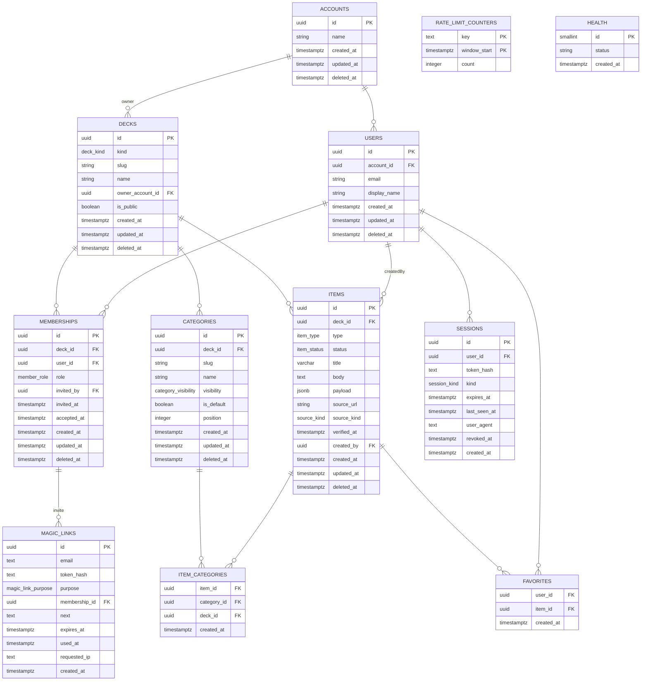

# Architecture — Gobbit (Community Pocketbook) Phase 2

## Overview

Gobbit (repository: community-pocketbook) is a monorepo (pnpm) organizing shared logic, persistence, API, and testing into isolated, typed packages.

### Workspace structure

- **`@pb/shared`** (packages/shared): Enums, limits, validation schemas (Zod), and utility functions. Single source of truth for domain constraints. Exports normalized to one entry point.
- **`@pb/db`** (packages/db): Drizzle ORM schema, migrations (drizzle-kit generated + hand-written custom), seeding logic, and database client. Exposes migrations, schema types, test fixtures.
- **`@pb/api`** (apps/api): Hono REST API with OpenAPI documentation. Layered: routes (parse input) → services (rules) → repositories (SQL). Error handling via RFC 9457 Problem+JSON. Magic-link sign-in with server-side sessions, per-deck roles and category visibility (Phase 2).
- **`e2e`** (e2e/): Playwright test suite with smoke tests tagged `@smoke`.
- **`@pb/web`** (apps/web): Placeholder for Phase 3 frontend.

All packages are private, ES modules, strict TypeScript. Runtime via `tsx` (no build step). TypeScript source is published as-is, with tsconfig.base.json enforcing `target ES2022, module ESNext, strict` (`noUncheckedIndexedAccess` deliberately off — see ADR-022).

### Key dependencies

Root: typescript 6.0, vitest 5, eslint 10, typescript-eslint 8, prettier 3, tsx 4.
@pb/shared: zod 4.6, mathjs 15.
@pb/db: drizzle-orm 0.45, pg 8.23, uuid 14, drizzle-kit 0.31, @testcontainers/postgresql 12.
@pb/api: hono 4.13, @hono/zod-openapi 1.6, @hono/node-server 2, @sindresorhus/slugify 3.
e2e: @playwright/test 1.63.

TypeScript is held at 6.0 (not 7.x) because typescript-eslint supports `typescript <6.1`. `@types/node` tracks Node 22, the minimum in `engines` and CI.

---

## Data Model



### Key design patterns

- **Soft deletes**: All user-facing tables have `deleted_at` timestamp. Queries always filter `WHERE deleted_at IS NULL` unless explicitly archiving.
- **Denormalization**: `item_categories` includes `deck_id` to enable composite FK constraints without a separate join.
- **Unique constraints on slugs**: Partial unique indexes on slug + deck where `deleted_at IS NULL` prevent collisions among active records.
- **Timestamps with millisecond precision**: All `timestamptz` columns use `precision: 3` (JavaScript Date compatibility required for keyset cursors).
- **Invariant triggers**: Database enforces cross-table rules (default category protection, auto-creation, timestamps).

---

## Invariants

| Invariant | Description | Enforced by |
|-----------|-------------|------------|
| **Published item → ≥1 category** (master plan P1.2) | An item with status='published' must have at least one category. | Service only: `items.create()` (D6 assigns `general` when none given) and `items.update()` rejects a result that would be published with no categories. The master plan's "trigger later" is not scheduled yet. |
| **D5: item_categories dual FK** | Each item_category row references both item and category via composite FK, ensuring consistency. | Drizzle schema composite FK with ON DELETE CASCADE. |
| **D6: Empty categoryIds → default** | If item created with no categoryIds, automatically assign default category of deck. | Service `items.create()` after fetching default. |
| **D7: Default category auto-create + protect** | Every deck gets a 'general' default category on insert. Cannot be deleted or have is_default=false. | DB trigger `decks_create_default_category` (INSERT) + `categories_protect_default` (DELETE/UPDATE); unique index `categories_one_default_uq` ensures ≤1 default per deck. |
| **D3: Slugs** | `decks.slug` unique among live decks; `categories.slug` unique per deck. | Partial unique indexes `decks_slug_active_uq`, `categories_deck_slug_active_uq` (`WHERE deleted_at IS NULL`); 23505 → 409. |
| **D8: Body budget** | `body` ≤ `CARD_BODY_MAX` (600) Unicode code points. | zod `itemBodySchema` in @pb/shared; DB check constraint on `char_length(body)` (`0003_card_limits`). |
| **Soft delete** (master plan P1.1, ADR-005) | Deleting sets `deleted_at` on accounts, users, decks, categories, items and memberships; queries exclude soft-deleted rows. Join tables (`item_categories`, `favorites`) are hard-deleted by design. | All repository `.find*()`, `.list()` include `WHERE isNull(t.deletedAt)`. Service `items.softDelete()`. |
| **Auto `updated_at`** (master plan P1.1) | Every update to accounts, users, decks, categories, items and memberships sets `updated_at = now()`. | DB trigger `<table>_set_updated_at` BEFORE UPDATE on each table. |
| **D9/D10: Payload budget and shape** | Each item type (text, link, image, table, calc) validates payload against a strict Zod schema. Payload ≤ 8192 UTF-8 bytes; DB enforces ≤ 9216 with a check constraint. | `payloadSchemaFor(type)` and the byte budget in @pb/shared (zod is authoritative); service calls `parse()` on PATCH; DB check constraint `items_payload_size_chk`. |
| **D12: Item type immutable** | Cannot PATCH an item's type. | Service `items.update()` rejects `'type' in patch` with 400. |
| **D13: Status default published** | Item created without a status defaults to 'published' and `verified_at = now()`. | Service `items.create()` sets both. |
| **D14: Pagination keyset cursor** | Cursor encodes (createdAt, id) tuple, limiting result sets. Limit default 20, max 50; >50 rejects. | `limitSchema` in @pb/shared; `itemListQuerySchema`; service `items.list()` decodes, queries with SQL keyset filter. |
| **D15: Favorite idempotence** | Adding/removing favorite twice is safe (no error). | Repository `favorites.add()` uses `onConflictDoNothing`; `favorites.remove()` does not error if missing. |
| **D16: Session auth gate** (Phase 2, replaces dev auth) | Routes that need a caller require a valid session (bearer or cookie); anonymous requests to them get 401. `/health`, `/openapi.json`, `/auth/magic-link` and `/auth/callback` are open. | Middleware `sessionAuth()` resolves the caller but never demands one; each protected route calls `getUser()` (401). A stale or invalid cookie is 401 + cleared, except on `LENIENT_PATHS` (the four open paths), where it is ignored so a signed-out browser can still sign in. |
| **D17: Access control** (Phase 2: D33–D35) | No role on a deck → 404; a role without the permission → 403 `/problems/forbidden`. | `authorize()` in `access/authorize.ts` (`resolveRole` + `can()`), called by every deck-scoped service method. |
| **D36: One membership per user–deck** | Partial unique `(deck_id, user_id) WHERE deleted_at IS NULL`; owner-account users can't be members of their own decks. | Unique index + `BEFORE INSERT OR UPDATE OF deck_id, user_id` trigger raising `owner_account_membership` (`0005_auth_triggers`), mapped to 400. |
| **D18: Problem schema** | All errors returned as RFC 9457 problem+json with type URL, status, title, detail, and optional field errors. | `Problem`, `ProblemFieldError` schemas in @pb/shared; error handlers in middleware convert Zod, pg, and app errors. |
| **D19: Migration rollback** | `db:rollback` reverses the latest applied migration by running its `.down.sql` and deleting the journal entry. | `rollbackLatest()` in `src/migrations.ts` executes down file in transaction, maps tag from __drizzle_migrations. |
| **D21: E2E smoke tests** | Tagged tests `@smoke` each create and delete their own `smoke-<id>` deck (D50), all read /health before starting. | Playwright config `testDir: ./tests`, global-setup waits for health + latest migration tag match. |

---

## Layering & Architecture

### Request flow

```
Route (HTTP handler, parses input via Zod)
  ↓
Service (business logic, access control, cascades)
  ↓
Repository (Drizzle SQL, returns Row types)
  ↓
Mapper (Row → DTO, Date → ISO string)
  ↓
HTTP Response (JSON, status code, problem+json on error)
```

### Single source of truth: @pb/shared schemas

All DTOs, constraints, and enums live in @pb/shared:
- **Limits** (CARD_TITLE_MAX=120, CARD_BODY_MAX=600, PAGE_LIMIT_MAX=50, PAYLOAD_MAX_BYTES=8192, etc.)
- **Enums** (deckKinds, categoryVisibilities, itemTypes, itemStatuses, sourceKinds)
- **Validation** (Zod schemas for create/patch inputs, payloads, pagination, problems)
- **Utilities** (UTF-8 byte counting, cursor encoding/decoding, calc expression validation)

Services and repositories import these, ensuring consistency across API, tests, and migrations.

### Route registration

Routes use `@hono/zod-openapi`:
- Input: path params (z.object), query (z.object), JSON body (z.object)
- Output: 200/201 with content schema; 4xx/5xx with `problemSchema`
- Metadata: method, path, security (`AUTH_SECURITY` = `SessionCookie` or `BearerToken`), description
- Handler: receives validated input, calls service, returns DTO or 404/409/422

Example pattern:
```ts
const route = createRoute({
  method: 'post',
  path: '/decks/{id}/items',
  request: { 
    params: z.object({ id: z.string().min(1) }),
    body: { content: { 'application/json': { schema: itemCreateSchema } }, required: true }
  },
  responses: {
    201: { content: { 'application/json': { schema: itemSchema } } },
    400: { content: { 'application/problem+json': { schema: problemSchema } } }
  },
  security: AUTH_SECURITY
});

app.openapi(route, async (c) => {
  const user = getUser(c);
  const { id } = c.req.valid('param');
  const input = c.req.valid('json');
  const item = await services.items.create(user, id, input);
  return c.json(item, 201);
});
```

### Service layer

Services encapsulate business rules:
- **Access control**: `authorize(user, deck, permission, memberships)` resolves the role and asserts the permission
- **Validation**: call Zod `parse()` on structured inputs (e.g., payload by type)
- **Cascades**: when creating a deck, fetch the default category; when updating an item, maybe recompute isFavorite
- **Soft delete**: use repository methods; service owns the semantics (e.g., `archive()` is idempotent)

### Repository layer

Repositories abstract SQL:
- **Queries exclude soft-deleted**: `where(isNull(t.deletedAt))`
- **Return row types**: `accountId: string | null` if nullable in DB
- **Transactions**: item creation inserts item + item_category rows atomically
- **No business logic**: repositories are thin data accessors

### Mappers

Convert database rows to API DTOs:
- Dates: `Date → ISO string` (via `.toISOString()`)
- Nullable dates: remain `null`
- Extra fields: `categoryIds`, `isFavorite` fetched separately, attached in service
- Type consistency: TS strict mode ensures no `undefined`

---

## Error Format & Status Codes

### RFC 9457 Problem+JSON

All errors (except 5xx) follow the Problem schema:

```json
{
  "type": "/problems/validation",
  "title": "Validation failed",
  "status": 400,
  "detail": "...",
  "errors": [
    { "path": "categoryIds", "message": "Unknown categories" }
  ]
}
```

### Error mapping table

| Scenario | Status | type | title | Detail |
|----------|--------|------|-------|--------|
| Zod parse fails | 400 | /problems/validation | Validation failed | From ZodError |
| Payload exceeds 8192 bytes | 400 | /problems/validation | Validation failed | "Payload exceeds 8192 bytes (UTF-8)" |
| Cursor invalid base64 | 400 | /problems/invalid-cursor | Invalid cursor | "Invalid cursor" |
| Invalid calc expression | 400 | /problems/validation | Validation failed | "Invalid expression: ..." |
| Missing Authorization | 401 | /problems/unauthorized | Unauthorized | "Authentication required" |
| Deck not found | 404 | /problems/not-found | Not Found | "Deck not found" |
| Item not found | 404 | /problems/not-found | Not Found | "Item not found" |
| Route not found | 404 | /problems/not-found | Not Found | "Route not found" |
| Slug already exists (pg 23505) | 409 | /problems/conflict | Conflict | "Resource already exists" |
| Default category protected (pg P0001) | 409 | /problems/default-category-protected | Default category is protected | From constraint |
| Foreign key missing (pg 23503) | 422 | /problems/invalid-reference | Invalid reference | "Invalid reference" |
| Check constraint (pg 23514) | 422 | /problems/constraint-violation | Constraint violation | "Constraint violation" |
| Immutable field (type) in PATCH | 400 | /problems/bad-request | Bad Request | "Item type is immutable" |
| Published item no categories | 422 | /problems/item-needs-category | (custom) | "A published item needs at least one category" |
| 5xx (unhandled) | 500 | /problems/internal | Internal Server Error | (omit internals from response) |

### Error handler middleware

- Catches exceptions during request handling
- `instanceof HttpError`: convert to Problem
- `instanceof ZodError`: convert via `problemFromZodError()`
- `instanceof InvalidCursorError`: 400 /problems/invalid-cursor
- `mapPgError(err)` detects pg codes (23505, 23514, 23503, P0001); non-null → respond with mapped Problem
- All other errors: log with requestId, respond 500 /problems/internal (no stack trace to client)

---

## Pagination

### Keyset cursor pattern

Instead of offset, use the last row's sort key to fetch the next batch:

```ts
// First request: no cursor
GET /decks/{id}/items?limit=20

// Response
{
  "data": [...],
  "nextCursor": "eyJjIjoiMjAyNC0wMS0xNVQxMDozMDowMCswMDowMDAiLCJpIjoiYWJjZC4uLiJ9"
}

// Next request
GET /decks/{id}/items?cursor=eyJjIjoiMjAyNC0wMS0xNVQxMDozMDowMCswMDowMDAiLCJpIjoiYWJjZC4uLiJ9&limit=20
```

### Cursor encoding/decoding

- **Encode**: `Buffer.from(JSON.stringify({ c: isoString, i: uuid })).toString('base64url')`
- **Decode**: base64url → JSON → `{ createdAt: string, id: string }` OR throw InvalidCursorError
- **Format**: `(createdAt, id) < cursor.values (both DESC)`

### Limits

- **Default**: 20 items
- **Max**: 50 items
- **>50 rejected**: request validation fails (400)
- **≤0 rejected**: request validation fails (400)

### Pagination schema

```ts
limitSchema = z.coerce.number().int().min(1).max(PAGE_LIMIT_MAX).default(PAGE_LIMIT_DEFAULT)
pageSchema<T>(item: T) = z.object({ 
  data: z.array(item), 
  nextCursor: z.string().nullable() 
})
```

---

## Authentication

### Magic links (D22–D26)

1. `POST /auth/magic-link { email }` always answers `200 { ok: true }` (no account enumeration; a malformed email is `400`). Rate limits run first (see below). The link token is `base64url(randomBytes(32))`; only `sha256(token)` is stored in `magic_links.token_hash`.
2. The mail (`Mailer`: `ResendMailer` / `ConsoleMailer` / `MemoryMailer`, chosen by `MAIL_PROVIDER`) carries `${API_URL}/auth/callback?token=…`. Sign-in links live `MAGIC_LINK_TTL_MINUTES` (15), invite links `INVITE_TTL_DAYS` (7).
3. `GET /auth/callback?token=` consumes the link with one atomic `UPDATE … WHERE used_at IS NULL AND expires_at > now() RETURNING *` (zero rows → invalid/used/expired, reason derived afterwards). The user is found or created in exactly one place, `users.service.findOrCreateByEmail()` (D25). For invites it sets `accepted_at`. It opens a cookie session and answers `303` to `${APP_URL}${next}` (or `${API_URL}/me` without `APP_URL`); `next` must be a relative path (`^/[^/\\]`). A bad link → `303 ${APP_URL}/auth/error?reason=…` or `401 /problems/magic-link-invalid`.

### Sessions (D27–D31)

- `sessions` rows are opaque random tokens stored as hashes, `kind` `cookie | bearer`, sliding lifetime `SESSION_TTL_DAYS` (90): `last_seen_at`/`expires_at` are bumped in one `UPDATE` at most once an hour.
- Cookie `gobbit_session`: `HttpOnly`, `SameSite=Lax`, `Path=/`, `Secure` per `COOKIE_SECURE`, `Domain` per `COOKIE_DOMAIN` (host-only when unset).
- **Precedence**: `Authorization: Bearer` first; the cookie only when no bearer header exists. A bad bearer is `401 /problems/session-invalid` even with a valid cookie.
- `POST /auth/token-exchange` (cookie-authenticated only) mints a separate `bearer` session and returns `{ token, expiresAt }` once.
- `POST /auth/logout` revokes the current session (clears the cookie); `POST /auth/logout-all` revokes all of the user's sessions.
- Lookup is by hash, then `timingSafeEqual` on the stored hash. All expiry logic reads the injected clock `now()` (D42).

### CORS and CSRF (D32)

`hono/cors` with `CORS_ORIGINS` and `credentials: true`. `middleware/csrf.ts` wraps `hono/csrf` over `CORS_ORIGINS` plus the API's own origin, for cookie-authenticated unsafe requests; requests with an `Authorization` header skip it. Rejections are `403` problem+json.

### Deployment layout (D46)

Images come from GHCR (ADR-033); backups and restore are in `infra/README.md`. One origin `https://gobbit.niranhome.win`: Traefik routes `PathPrefix(/api)` to the API with a strip-prefix middleware (labels in `infra/docker-compose.yml`), so `API_URL=https://gobbit.niranhome.win/api`, `COOKIE_DOMAIN` unset, `CORS_ORIGINS=https://gobbit.niranhome.win`, `CLIENT_IP_HEADER=cf-connecting-ip`.

## Authorization (D33–D35)

- `resolveRole(user, deck, membership)`: users of the deck's `owner_account_id` are implicitly `owner`; otherwise the **accepted** membership's role; pending or none → no role.
- `can(role, permission)` (`@pb/shared` authz) is a pure table over the `Permission` union; the matrix is unit-tested exhaustively.
- `authorize()` combines both: no role → `404` (ADR-004); role lacking the permission → `403 /problems/forbidden` with `permission` and `role` extension members.
- `GET /decks` and `GET /me` return owned ∪ accepted-member decks, each with the caller's `role`.
- Memberships: `GET /decks/:id/members` (implicit owner first, pending included), `POST /decks/:id/invites { email, role }` (creates the user if needed, pending membership + invite link; `201`, resend `200`, accepted member `409`, self `400`), `DELETE /decks/:id/members/:userId`.
- A resend to a pending member replaces the invite: the membership takes the new `role`, inviter and `invited_at`, and every unused invite link of that membership is expired (it reports `reason=expired`), so only the newest link works.
- `owner` memberships (co-admins) get every owner permission except `deck.delete`: `DELETE /decks/:id` additionally requires the caller to belong to the deck's owner account (`403 /problems/forbidden`, `permission: deck.delete`, `role: owner`). This is the one rule outside the `can()` matrix (D34 had deferred resource-level rules).

## Visibility (D38)

`visibleCategoriesWhere(role)` (`access/visibility.ts`) is the single predicate: owner/maintainer → all; editor/reader → `shared` + `public`; no role → `public` (Phase 8). It is applied in:

1. category listing,
2. item listing (`EXISTS` over `item_categories ⋈ categories`, so pagination stays consistent),
3. item get (no visible category → `404`),
4. the `?category=` slug filter (invisible → `404`),
5. `categoryIds` validation on create/patch (invisible → `400`),
6. the item DTO (`categoryIds` lists only visible categories).

## Rate limits (D39–D40)

Postgres table `rate_limit_counters`, fixed one-hour windows, `INSERT … ON CONFLICT DO UPDATE SET count = count + 1 RETURNING count`. Keys and limits (from `@pb/shared`): `magic-link:email:<sha256>` 5, `magic-link:ip:<ip>` 20, `callback:ip:<ip>` 30. The email counter is checked before any user lookup, so a `429 /problems/rate-limited` (with `Retry-After`) reveals nothing. Rows older than two windows are purged on ~1% of increments. The client IP is the socket address unless `CLIENT_IP_HEADER` names a trusted header; `X-Forwarded-For` is never trusted implicitly.

---

## Migrations & Schema Evolution

### Generation & structure

1. **Generated** by drizzle-kit: `pnpm db:generate` reads schema files in `src/schema/`, outputs SQL to `migrations/`
2. **Hand-written custom**: `migrations/0002_invariants.sql` (triggers, functions, indexes)
3. **Automatic naming**: `0000_health`, `0001_core`, `0002_invariants` (custom), `0003_card_limits`, `0004_auth`, `0005_auth_triggers` (custom)
4. **Down files**: `migrations/down/<tag>.down.sql` for rollback

### Custom migrations: 0002_invariants

- Function `set_updated_at()`: sets `NEW.updated_at = now(); RETURN NEW;`
- Trigger `<table>_set_updated_at`: runs before UPDATE on accounts, users, decks, categories, items
- Function `create_default_category()`: inserts 'general' category
- Trigger `decks_create_default_category`: runs after INSERT on decks
- Function `protect_default_category()`: prevents deletion/modification of default category (raises P0001)
- Trigger `categories_protect_default`: runs before DELETE or UPDATE on categories
- Unique index `categories_one_default_uq`: max one default per deck

### Card limits: 0003_card_limits

Three check constraints on items table:
```sql
check('items_body_len_chk', char_length(body) <= 600)          // CARD_BODY_MAX
check('items_payload_size_chk', octet_length(payload::text) <= 9216)  // PAYLOAD_DB_BACKSTOP_BYTES
check('items_payload_object_chk', jsonb_typeof(payload) = 'object')
```

### Journal & rollback

- `migrations/meta/_journal.json`: drizzle-kit maintains this; each entry: `{ idx, when, tag }`
- **when**: bigint timestamp (ms) of migration creation
- **__drizzle_migrations** table: drizzle auto-creates on first run; stores when and name
- **getLatestMigrationTag**: query `__drizzle_migrations ORDER BY created_at DESC LIMIT 1`, match when to journal entry
- **rollbackLatest**: load down file, run in transaction, delete row from __drizzle_migrations

### Health endpoint

`GET /health` returns:
```json
{
  "ok": true,
  "db_ms": 2,
  "migration": "0005_auth_triggers",
  "commit": "<40-char sha from GIT_SHA, or null outside a CI-built image>"
}
```

Exposing the latest migration tag helps e2e tests confirm the DB is in the expected state before starting.

---

## Seeding and test data (D49)

### Owner-only seed

`pnpm db:seed` (`packages/db/scripts/seed.ts` → `seed/run-seed.ts`) upserts exactly **one account and one user** — the owner — and nothing else. No decks, categories or cards are seeded; a fresh deployment starts empty.

- `SEED_OWNER_EMAIL` is required (the script exits non-zero without it); `SEED_OWNER_NAME` defaults to the email local part. Parsing lives in `seed/owner.ts` (`parseOwnerSeedEnv`).
- Ids are uuid v5 under `SEED_NAMESPACE` (`seedId('owner')` for the account, `seedId('owner/user')` for the user), so re-running upserts in place.
- Idempotent: `ON CONFLICT … DO UPDATE … WHERE … IS DISTINCT FROM`, so a second run with the same values leaves `updated_at` untouched; a changed name or email updates the row in place.
- Local development only: the script refuses `NODE_ENV=production` outright (Oct 1). A deployed instance is never seeded; the owner's first magic-link sign-in creates the user (D25).
- `SMOKE_SESSION_TOKEN` (D43, ≥32 chars) upserts one 365-day `bearer` session for the owner (`user_agent = 'smoke'`); re-running with a new token rotates it. No other users are seeded.

### Test factories (`@pb/db/test`)

Integration tests build their own data; nothing depends on seeded rows.

- `factories.ts`: `createAccountUser`, `createDeck` (the trigger adds `general`), `defaultCategory`, `createCategory`, `createItem` (runs the card through `itemCreateSchema`, links categories, defaults to `general`), `addFavorite`. Ids come from `fixtureId(key)` — uuid v5 under a separate `FIXTURE_NAMESPACE`.
- `fixtures/sample-cards.ts`: the 25 Phase 1 cards (`SampleCard`: `ItemCreate` + category slugs + status/lang/favorite), and `SAMPLE_CATEGORIES`. Its unit test pins the shape the suites rely on: 23 published + 2 archived, 12 food (all published), 2 table, 1 calc, 1 favorite, he/el/en.
- `sample-world.ts`: `createSampleWorld(db)` reproduces the Phase 1 layout — owner (`owner@example.test`) with decks `personal` (empty), `family` (six categories + the 25 cards), `scratch` (empty), and a second user (`other@example.test`) with `other-personal`. `apps/api/test/helpers.ts#setupApiTest()` builds it once per suite and exposes it as `world`.

## Test Pyramid

### Unit tests

Location: `**/*.test.ts` (next to source)  
Environment: Node  
Test data: mocked/inline  
Examples:
- `@pb/shared/src/schemas/pagination.test.ts`: cursor encoding, Zod parse
- Service unit tests with mocked repos

### Integration tests

Location: `**/*.int.test.ts` (under `test/`)  
Environment: Node + Docker (Testcontainers PostgreSQL)  
Test data: built with `@pb/db/test` factories (`createSampleWorld()`)  
Examples:
- Repository tests (actual SQL via Drizzle)
- Service tests calling real repos
- API route tests via `setupApiTest()`

**Test isolation**: Each test file gets a fresh DB cloned from `template_pb`:
1. Global setup: creates template DB with all migrations
2. Per file: `withTestDb()` clones the template (fast), the file's tests run, the clone is dropped

### E2E tests (smoke)

Location: `e2e/tests/smoke/*.spec.ts`  
Environment: Playwright  
Base URL: `http://localhost:3000` (or BASE_URL env)  
Tagging: every test title includes `@smoke`

**Pre-test**: global-setup waits for `/health` to report `ok=true` and migration tag matching the latest journal entry — and, when `EXPECTED_SHA` is set (CI sets the triggering commit), `commit` equal to it, for up to 10 minutes while Dokploy pulls and restarts.

**API helpers**:
- `api`: request context carrying `Authorization: Bearer ${SMOKE_SESSION_TOKEN}` (locally the seeded owner session; deployed, a bearer minted with `/auth/token-exchange`)
- `anon`: request context with no credentials (401 checks)
- `smokeDeck`: creates a `smoke-<id>` deck before the test; afterwards removes its memberships and soft-deletes it
- The members spec invites the single standing user `smoke-invitee@example.test`; only its membership is cleaned up

---

## Architecture Decision Record

### ADR-001: Millisecond-precision timestamps for keyset cursors

**Decision**: All `timestamptz` columns use `precision: 3`.

**Rationale**: JavaScript `Date` is millisecond-based. Keyset pagination encodes `(createdAt, id)` in the cursor. If DB precision is microsecond but JS rounds to ms, the cursor may round-trip incorrectly, causing duplicates or gaps. Fixing precision at ms guarantees accurate serialization.

---

### ADR-002: Vitest test.projects instead of vitest.workspace

**Decision**: Root `vitest.config.ts` defines two test.projects (unit, integration) instead of separate workspace packages.

**Rationale**: 
- Simpler coverage thresholds (one config applies to all)
- Integration tests can safely use globalSetup (Testcontainers) without interfering with unit tests
- Single command `pnpm test` runs all; `pnpm test:unit` or `pnpm test:int` filters by project
- FileParallelism=false for integration tests (sequential DB access); unit tests run in parallel

---

### ADR-003: TypeScript source exports, no build step

**Decision**: Packages export `.ts` files directly from `src/`, evaluated at runtime via `tsx`.

**Rationale**:
- Faster iteration: change src, tests pick it up immediately
- Single source of truth: no divergence between src and build output
- Simpler tooling: no tsconfig build path mappings, no esbuild config
- Type checking: `tsc --noEmit` validates syntax; runtime safety from Zod at boundaries

**Trade-off**: Slightly slower runtime (tsx transpiles on-the-fly), acceptable for Phase 1 API server; Web frontend (Phase 3) will bundle.

---

### ADR-004: 404 for foreign decks, not 403

**Decision**: When a user accesses a deck they don't own, return 404 (not found), not 403 (forbidden).

**Rationale**:
- Doesn't leak information about which resources exist
- Consistent with "access control as query filter" pattern (repository only sees user's own data)
- Phase 2 can refine to shared/public decks; 404 still applies to truly private ones

**Implementation**: Phase 1 used `assertDeckAccess()`; since Phase 2 `authorize()` (`access/authorize.ts`) throws `notFound()` when the caller has no role on the deck (D35), and 403 only when a role lacks the permission.

---

### ADR-005: Soft deletes via `deleted_at` timestamp

**Decision**: Never physically remove rows; set `deleted_at = now()`.

**Rationale**:
- Audit trail: can query deleted items if needed
- Foreign key safety: references don't break if a category is deleted
- Reversible: undelete possible (though not exposed in Phase 1 API)
- Compliance: supports data retention policies

**Query pattern**: All reads include `WHERE deleted_at IS NULL`.

---

### ADR-006: Denormalized deck_id in item_categories

**Decision**: `item_categories` table includes `deck_id` even though it's redundant (reachable via itemId → items → deckId).

**Rationale**:
- Enables composite foreign key: `FK(itemId, deckId) → items(id, deckId)`
- Prevents a bug where an item_category references an item in a different deck
- Marginal storage cost, significant constraint benefit

---

### ADR-007: Default category auto-created and protected

**Decision**: Every deck gets an automatic 'general' category on insert. Cannot be deleted or modified to `is_default=false`.

**Rationale**:
- UX: users always have at least one category to tag items
- Safety: avoids "item with no categories and status=published" edge case
- Database enforces via trigger + unique index, not app logic

**Cascade exception**: When deck is deleted, the trigger cleanup is allowed (pg_trigger_depth > 1 check).

---

### ADR-008: Payload validation in @pb/shared, re-validated on PATCH

**Decision**: `payloadSchemaFor(type)` lives in @pb/shared. Service re-validates payload on PATCH.

**Rationale**:
- Schema is single source of truth for all consumers (API, tests, migrations)
- PATCH may not provide type (immutable), so service must know which schema applies
- Validation failure → 400, not 422 (matches Zod error convention)

---

### ADR-009: Limit >50 rejects, doesn't clamp

**Decision**: `limitSchema` rejects values >50 with a validation error, never silently reduces.

**Rationale**:
- Explicit: client knows the constraint
- Prevents accidental large result sets (DoS risk)
- Encourages clients to paginate properly

---

### ADR-010: RFC 9457 Problem+JSON for all errors

**Decision**: API always returns error responses as `application/problem+json` with type, status, title, detail, errors.

**Rationale**:
- Standardized: clients can parse error details uniformly
- OpenAPI: schema documented in /openapi.json
- Field errors: Zod validation failures list path + message for each field
- Type URL: clients can decide action (409 /conflict ≠ 422 /constraint-violation)

---

### ADR-011: Migration rollback via .down.sql

**Decision**: Each migration can be rolled back; down file executed in a transaction, then journal entry deleted.

**Rationale**:
- Not every migration is reversible (data loss possible), but metadata changes (add column) are
- Hand-written down files are explicit, not auto-generated (forces thinking)
- Single transaction: either fully rolls back or fails atomically
- Emergency recovery: can revert to prior schema without manual intervention

---

### ADR-012: Seed with uuid v5 namespace

**Decision**: Deterministic IDs via `v5(key, SEED_NAMESPACE)`.

**Rationale**:
- Reproducible: same seed produces same IDs every run
- Testable: suites assert on stable ids like `fixtureId('deck/family')` (since D49 these come from test factories, not the seed)
- No collisions: different keys hash to different IDs
- Never in production: seed only used in dev/test (guarded by env check)

---

### ADR-013: Pagination cursor encodes (createdAt, id)

**Decision**: Keyset cursor is base64url-encoded JSON: `{ c: isoString, i: uuid }`.

**Rationale**:
- Immutable sort: createdAt + id is unique, immutable per-row
- Doesn't count results: scales to large tables
- Works with DESC order: clients naturally iterate forwards in time
- Human-readable when decoded

**Alternative considered**: Offset pagination (simple, bad for large tables).

---

### ADR-014: Calc expression validation with mathjs walk, no evaluation

**Decision**: `validateCalcExpression()` parses expression tree, walks nodes to check allowed functions/symbols. Never evaluates.

**Rationale**:
- Safety: code evaluation is a security risk
- Deterministic: validation is stable (no random number gen affecting outcome)
- Error messages: can report specific disallowed functions
- Phase 2: server-side evaluation can safely use validated expressions

---

### ADR-015: Item type immutable, idempotent favorites

**Decision**: PATCH rejects if `'type' in patch` (400 bad-request). Favorite add/remove is idempotent.

**Rationale**:
- Type change would require payload migration (complex), so forbid it
- Idempotence: `POST /items/{id}/favorite` twice is safe (onConflictDoNothing), `DELETE` twice is safe (no error on missing)
- Phase 2: if client retries a request, idempotence prevents duplicates

---

### ADR-016: Dev auth middleware with constant-time comparison

**Status**: Superseded by ADR-025 and ADR-031 (Phase 2).

**Decision**: Dev token validated via `timingSafeEqual`, length checked first. Removed in Phase 2.

**Rationale**:
- Timing attack resistance: attacker can't infer token char-by-char from timing
- Phase 1 scaffold: simple bearer + header, no sessions, no magic links
- Secure default: even in dev, follow crypto best practices
- Bypass list: /health and /openapi.json for liveness/discovery

---

### ADR-017: Access control in service layer

**Decision**: access is checked in the service layer. Phase 1: `assertDeckAccess(user, deck, action)` (ownership). Phase 2: `authorize(user, deck, permission, memberships)` — `resolveRole()` + `can()` — called by every service method that touches a deck.

**Rationale**:
- Centralized: consistent policy across routes
- Fail-safe: throws 404 not found (doesn't expose existence)
- Extensible: Phase 2 added `can()` granularity via `authorize()` (see Authorization)

---

### ADR-018: Problem schema with optional field errors, pg error mapping

**Decision**: `Problem` includes optional `errors: ProblemFieldError[]`. `mapPgError()` detects constraint codes and returns mapped Problem.

**Rationale**:
- Field errors: Zod validation can report path + message per field
- Pg error mapping: 23505 (unique) → 409, 23514 (check) → 422, P0001 (custom) → varies
- No SQL leakage: error message sanitized, constraint name omitted from response

---

### ADR-019: Migration journal↔__drizzle_migrations sync

**Decision**: `migrations/meta/_journal.json` is the source of truth. `__drizzle_migrations` table is drizzle's internal state. `getLatestMigrationTag()` matches `when` (ms) between them.

**Rationale**:
- Drizzle creates __drizzle_migrations; we can't control its schema
- Journal is our integration point: stable, human-readable
- Matching on timestamp: every migration is timestamped, can find it in both places
- Rollback: deletes from __drizzle_migrations, doesn't touch journal (audit trail)

---

### ADR-020: Testcontainers PostgreSQL with template DB cloning

**Decision**: Global setup creates `template_pb` with all migrations. Each test clones it. Integration tests in isolation, fast.

**Rationale**:
- Parallelizable: tests can run independently (each has own DB)
- Fast: clone is faster than rerunning migrations per-test
- Reliable: clean slate per test (no test-to-test pollution)
- Scalable: CI can use `-j` to run tests in parallel

---

### ADR-021: Smoke tests with @smoke tag and health wait

**Decision**: E2E tests tagged `@smoke` each work in their own `smoke-<id>` deck (D50). Global setup waits for `/health` ok=true + migration tag match.

**Rationale**:
- Isolation: smoke tests use dedicated deck (don't interfere with other tests)
- Readiness: wait for health ensures DB migrations are done before tests start
- Reproducible: tag makes `pnpm test:e2e --grep @smoke` work

---

### ADR-022: Toolchain notes from the Phase 1 build

**Decisions**:
- **pnpm 11 build approval** uses the `allowBuilds:` map in `pnpm-workspace.yaml` (esbuild allowed; cpu-features, protobufjs, ssh2 denied). `onlyBuiltDependencies` is not honoured by pnpm 11.
- **Vitest `test.projects`** in the root `vitest.config.ts` replaces the deprecated `vitest.workspace` file.
- **Root devDeps for integration globalSetup**: `@testcontainers/postgresql`, `testcontainers`, `pg`, `drizzle-orm` are also declared at the root. Vitest resolves bare imports in a project's `globalSetup` from the workspace root, not the importing package.
- **`noUncheckedIndexedAccess` off**: it produced ~100 noise errors on array/row access across tests and repos. Row lookups rely on explicit guards (`if (!row) throw notFound()`).
- **HTTP error helpers return** an `HttpError` and callers `throw` them (`throw notFound()`), so control flow is visible to TypeScript.
- **pg pool `error` listener** in `createPool`: idle clients killed server-side (restart, `DROP DATABASE ... WITH (FORCE)`) would otherwise surface as an uncaught exception. `57P01` is ignored, everything else is logged.

---

### ADR-023: Open-source repository hygiene

**Decisions**:
- **Private notes stay local**: `plans/` (personal planning docs) and `docs/thrifty/` (AI build artifacts: prompts, per-sprint cost manifests) are gitignored. The public roadmap is the neutral `PLAN.md`.
- **No personal data in fixtures**: seed data and tests use `example.test` emails and generic households only.
- **CI on GitHub-hosted runners**: `ci.yml` runs on `ubuntu-latest` so fork PRs never execute on a private machine. `smoke.yml` (main only, targets the deployed API) picks its runner from the `SMOKE_RUNNER` repo variable, defaulting to `ubuntu-latest`, and is skipped while `API_BASE_URL` is unset. Actions are pinned to their latest major tags (Node 24 runtime); pnpm comes from `packageManager`, Node from `.nvmrc`.
- **E2E env resolution** (`e2e/lib/env.ts`): GitHub passes unset vars/secrets as empty strings, so blank values are treated as unset; `BASE_URL` must be an http(s) URL, and a missing one fails fast under `CI`.
- **Standard community files**: `CONTRIBUTING.md`, `SECURITY.md` (GitHub private vulnerability reporting, no personal email), `CODE_OF_CONDUCT.md` (Contributor Covenant 2.1), issue and PR templates.
- **License: MPL-2.0** (file-level copyleft): changes to project files are shared back, while the code can still be combined with proprietary code. Root `LICENSE` holds the full text; every `package.json` declares `"license": "MPL-2.0"`.
- **`"private": true` stays** in every `package.json`: it only blocks accidental npm publishing of this app monorepo.

### ADR-024: Rename pocketbook → deck, rewrite migrations in place, owner-only seed (D48–D50)

**Decisions**:
- The domain noun is **deck** everywhere: tables (`decks`, `deck_id`, enum `deck_kind`), constraint names, schemas, routes (`/decks…`) and docs. The product is **Gobbit**; the repository name is unchanged.
- **Migrations were rewritten in place** (`0001_core`, `0002_invariants`, `0003_card_limits` and their `down/` files) with the same tags, rather than adding a rename migration. This was safe because no deployed database held user data at the time: Phase 1 only ever ran against disposable dev, CI and seeded smoke databases, all of which are recreated from scratch. Any existing local database must be dropped and re-migrated.
- **Seed reset**: the seed creates only the owner user (see Seeding). Fake users and sample cards moved to test fixtures, so the deployed database contains no fabricated people.
- **`DELETE /decks/:id`** (soft delete; the partial unique index frees the slug) was added so the smoke suite can create a `smoke-<runId>` deck per test and remove it afterwards, leaving the deployed database as found.

---

### ADR-025: Opaque server-side sessions over JWT (D22, D27)

**Decision**: Sessions are random 32-byte tokens; only their sha256 is stored. Cookie and bearer sessions are both rows in `sessions`.

**Rationale**: Logout and "log out everywhere" are one `UPDATE`; no signing-key rotation or token blacklist; a DB leak yields no usable tokens. The cost (one indexed lookup per request) is negligible at this scale.

---

### ADR-026: Atomic single-use magic links (D23)

**Decision**: Consumption is a single conditional `UPDATE … RETURNING`; the failure reason is computed only afterwards.

**Rationale**: Two concurrent clicks can't both succeed, and there is no read-then-write race window.

---

### ADR-027: An invite creates the user (D25, D37)

**Decision**: `POST /decks/:id/invites` calls `findOrCreateByEmail()`, so a pending membership always has a non-null `user_id`.

**Rationale**: One code path creates users (Phase 9 can gate registration there); memberships stay simple FKs; the invite link only has to accept.

---

### ADR-028: Implicit owner via the account (D33)

**Decision**: Users of a deck's `owner_account_id` are `owner` without a membership row; a trigger forbids giving them one.

**Rationale**: Personal decks need no membership bookkeeping, and there is exactly one source of truth per user–deck pair.

---

### ADR-029: DTO category filtering (D38)

**Decision**: The item DTO's `categoryIds` is filtered by the same visibility predicate as the queries.

**Rationale**: A card shared with a reader must not leak the ids of private categories it is also filed under.

---

### ADR-030: Postgres rate limiting (D39)

**Decision**: Fixed-window counters in `rate_limit_counters`, no Redis.

**Rationale**: One fewer service to run; the atomic upsert is correct under concurrency; volumes are tiny. pg-boss (Phase 4) can take over the cleanup.

---

### ADR-031: Dev auth deleted, not flagged off (D43)

**Decision**: The dev-token flag, token variable, user header and middleware are removed. The smoke suite authenticates with a real owner bearer session (`SMOKE_SESSION_TOKEN`): seeded locally, minted with `/auth/token-exchange` on the deployed instance.

**Rationale**: A dormant bypass is a latent vulnerability; the smoke suite now exercises the real session path end to end.

---

### ADR-032: Owner-only seed with test factories (D49)

**Decision**: The seed creates only the owner (plus the optional smoke session); integration and smoke tests build their own data with `@pb/db/test` factories or per-test `smoke-<id>` decks.

**Rationale**: The deployed database contains no fabricated people or cards, and tests don't depend on shared mutable state.

**Update (Oct 1)**: the seed is local-only and refuses production; the deployed database is never seeded.

---

### ADR-033: Deploy the CI-built image; `/health` reports the commit

**Decision**: CI builds the API image once (with `GIT_SHA`), pushes it to GHCR and calls the Dokploy deploy webhook; Dokploy runs that image (`infra/docker-compose.yml`, `pull_policy: always`) on Dokploy's `dokploy-network`, behind the shared `cloudflared` → Traefik route. `/health` returns `commit`, and the smoke workflow waits for the commit it was triggered by before testing.

**Rationale**: The image that passed CI is the one that runs (no second build on the box), the same pattern as the owner's other Dokploy apps, and smoke can't pass against the previous container.

---

## Summary

Gobbit Phase 2 is a layered REST API with OpenAPI documentation, magic-link sessions, per-deck roles and category visibility, and comprehensive error handling. Data lives in PostgreSQL with invariants enforced at multiple levels (Zod schemas, database triggers, service checks). Pagination uses keyset cursors for stability. The seed creates only the owner user; tests build their data with factories. Testing spans unit (mocked), integration (Testcontainers), and e2e (Playwright smoke). Migrations are versioned with rollback support. Architecture emphasizes single source of truth (@pb/shared), type safety (strict TypeScript), and explicit error codes (RFC 9457). Phase 3 introduces the web frontend on the same origin.
